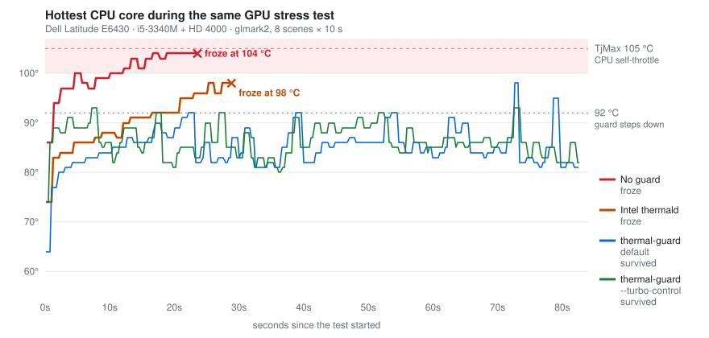

<div align="center">

# thermal-guard

**A small software thermal throttle for old Intel laptops whose firmware lets them overheat until they freeze.**

Python 3 · standard library only · one systemd service · i915 GPUs

</div>

<p align="center">
  
</p>

For two months this laptop froze "at random": in the browser, under a virtual machine, in
the middle of a benchmark. Every time it needed a hard power-off, and the logs showed nothing.
I changed distributions, swap setups, graphics drivers and kernel options before finding the
cause: **heat**. The CPU and GPU share one die, under load it can jump nine degrees in a third
of a second, and nothing between the silicon and the desktop slowed anything down in time.

`thermal-guard` watches the CPU temperature twice a second. When it gets too hot, it lowers
the GPU's clock limit one step at a time, and it raises it again once things cool down.
That was enough to stop the freezes.

---

## The story

### 1 · "Brave is freezing again"

It started with the browser. With many tabs open across several Brave profiles, the
desktop stuttered, then stalled, and sometimes never came back. It looked like a memory
problem, so that's what got fixed first. On the Fedora 44 install of the time, swap was a
compressed swapfile on btrfs with zswap in front of it, which compressed everything twice.
Both were replaced with zram. Paging got faster. The freezes didn't stop.

Even then the CPU package was sitting at **97 °C**, and the kernel's `idle_inject` threads
were forcing the cores idle to hold it there. That was the first clue, but it went unnoticed.

### 2 · "Maybe it's the desktop"

Every investigation after a freeze turned up a plausible culprit. There were always five:

- load of 15–18 on a 4-thread CPU;
- a desktop portal process spinning at 80 % for hours;
- i915 "atomic commit failed" errors from the compositor;
- Brave's video decoder throwing errors;
- a nearly full disk.

One freeze left a **column of green lines** frozen on the panel. Another left a **black
screen** and an unclean shutdown, after a six-hour build-up of graphics errors in the journal.

Temperature was on every one of those lists, at 98–103 °C. But it was always ranked as one
suspect among many.

### 3 · New distro, same freezes

A move to Arch didn't help. Heavy workloads such as a **Windows VM** froze the whole
machine. Video playback crashed too. That one was a genuine driver bug (Intel's old
`hasvk` Vulkan driver) and was fixed by removing it, which made it look as if the problem
had been software all along.

The last attempt was passing the laptop's GPU (an HD 4000) through to a VM. A benchmark
inside the guest froze the host. The obvious suspects were passthrough or the IOMMU.

### 4 · The control experiment

Then came the boring test: the same benchmark on the host, with no VM involved. **It froze too.**

Freezes like this leave no log, so I wrote a small [flight recorder](tools/flight-recorder.py)
that writes temperatures, clocks, fan speed and power to disk four times a second, with an
`fsync` after every line, so the data survives a power-off. It showed the cause:

| | |
|---|---|
| Idle CPU temperature | ~78 °C |
| After 20 s of GPU load | **104 °C**, then frozen |
| Power drawn | only ~28 W |
| CPU / GPU clocks | flat out, never reduced |
| Fan | stuck at ~3,600 of 4,900 rpm |

The variables were swapped one at a time. With the IOMMU off it still froze. With the clocks
capped by hand it survived, at 86 °C. **Only temperature made the difference.**

### 5 · Why the hardware doesn't protect itself

On paper this can't happen. Intel CPUs throttle themselves when they get too hot. Here is
what happens on this machine:

| Built-in safety net | What happens on this laptop |
|---|---|
| CPU self-throttling (TjMax) | starts at **105 °C**; the machine freezes at ~98–104 °C, before it kicks in |
| Lower that point (TCC offset, MSR `0x1A2`) | the register accepts 90 °C; the **BIOS ignores it**: 102 °C at full clocks, no throttle flags set |
| Turn the fan up | the BIOS owns the fan; a manual setting is reverted within 2 s, and manual mode is refused |
| Power limit (RAPL) | locked by the BIOS at 35 W; the chip only draws ~28 W, so the limit never applies |
| ACPI passive cooling | the firmware defines a single critical trip at 107 °C and nothing else |
| Intel **thermald** | **froze at 98 °C**: it [never touches the GPU and reacts too slowly](docs/thermald.md) |

Every safety net either belongs to the firmware, which doesn't use it, or acts on the CPU
while the GPU drives the heat.

### 6 · The fix

What was left was the one control Linux does have: the i915 driver's GPU clock limit. Writing
a lower number to `gt_max_freq_mhz` takes effect immediately, needs no reboot, and cuts the
heat at its source. thermal-guard is a short loop around that file.

---

## Results

The same test every time: eight glmark2 scenes, 10 seconds each, run on the desktop with the
flight recorder logging.

| Setup | Outcome | Peak | GPU speed kept* |
|---|---|:---:|:---:|
| Nothing | ❌ froze | 104 °C | — |
| Hardware throttle point lowered to 90 °C | ❌ stopped by hand (still at full clocks) | 102 °C | — |
| Intel thermald (stock) | ❌ froze | 98 °C | — |
| Fixed cap (turbo off, GPU at half clock) | ✅ survived | 86 °C | ~52 % |
| **thermal-guard** (default) | ✅ survived (2 runs) | 98–100 °C, brief spikes | **~85 %** |
| **thermal-guard** `--turbo-control` | ✅ survived | 93 °C | ~75 % |

<sub>* Phong shading scene FPS compared with the last uncapped run that got through it (1,519 FPS).</sub>

A fixed cap also works, but it costs half the GPU's speed all the time. thermal-guard keeps
the full clock until the temperature actually crosses the line. The default (CPU turbo left
on) is faster but can spike briefly to 98–100 °C at the start of heavy work. `--turbo-control`
also switches turbo off and kept the peak at 93 °C. **If you've seen freezes, use
`--turbo-control`.**

---

## How it works

Every 0.5 s it reads the hottest `coretemp` sensor and moves one level up or down:

| Level | 0 | 1 | 2 | 3 | 4 | 5 |
|---|:---:|:---:|:---:|:---:|:---:|:---:|
| GPU max clock (share of hardware max) | as found | 80 % | 68 % | 52 % | 40 % | minimum |
| CPU turbo, with `--turbo-control` | as found | on | off | off | off | off |
| On the HD 4000 above | 1250 MHz | 1000 | 850 | 650 | 500 | 350 |

- **≥ HOT**: one level down, at most once a second.
- **≥ VERY HOT**: two levels down at once.
- **≤ COOL for 5 s**: one level back up.

The thresholds come from your CPU's critical temperature, `crit − 13 / − 8 / − 20` (92 / 97 / 85 °C
on a 105 °C part), and can be overridden. A few ideas are borrowed from thermald and kept small:
the starting settings are saved and restored on exit; values that something else overwrites are
put back; and the GPU may disappear (for example while passed through to a VM) without
breaking anything. Every change goes to the journal:

```console
$ journalctl -u thermal-guard
thermal-guard: GPU /sys/class/drm/card1, 3 sensors, hot 92 / very hot 97 / cool 85 °C, turbo control off
98 °C: level 1 -> 3 (GPU max 650 MHz, turbo on)
98 °C: level 3 -> 5 (GPU max 350 MHz, turbo on)
85 °C: level 5 -> 4 (GPU max 500 MHz, turbo on)
```

---

## Install

```sh
git clone https://github.com/giri256/thermal-guard && cd thermal-guard
sudo python3 thermal-guard.py --dry-run     # optional: shows what it found, writes nothing (Ctrl-C to stop)
sudo sh install.sh                           # installs and starts the systemd service
journalctl -fu thermal-guard                # watch it work
```

Options go on the service's command line (`sudo systemctl edit --full thermal-guard`):

| Option | Effect |
|---|---|
| `--turbo-control` | also switch CPU turbo off from level 2 (recommended if you've had freezes) |
| `--hot N` `--very-hot N` `--cool N` | thresholds in °C |
| `--dry-run` | log decisions, change nothing |

Uninstall with `sudo sh install.sh --uninstall`. Stopping the service restores the original clocks.

### Will it help my laptop?

It may, if most of these apply:

- **Intel CPU with integrated graphics using the `i915` driver.** This covers roughly Sandy
  Bridge (2011) through Alder/Raptor Lake. Newer chips that use the `xe` driver aren't supported.
- Freezes that need a power-off and leave nothing in `journalctl -b -1`.
- They happen under GPU or mixed load: a browser with many tabs, video, a VM, games.
- `sensors` reads in the high 90s °C under load, with idle already in the 70s or above.
- thermald is installed and doesn't help.

**Caveat:** it has been tested on exactly one machine, a Dell Latitude E6430 (i5-3340M, HD 4000,
BIOS A24, Linux 6.18). To check yours, run [`tools/stress-test.sh`](tools/stress-test.sh)
with the guard stopped, then again with it running, and compare the peaks.

---

## Am I the only one?

I searched Reddit (r/linux, r/archlinux, r/Fedora, r/linuxquestions, r/brave_browser,
r/linux4noobs, r/Dell, r/thinkpad, r/VFIO, r/linux_gaming, r/linuxhardware) for posts linking
Intel iGPU hard freezes to heat. **I found nothing that connects them.** I did find many posts
with pieces of the same picture, and every one of them ended unresolved:

- [*Overheating laptop / thermald is not working*](https://www.reddit.com/r/linux4noobs/comments/z024va/):
  a Kaby Lake laptop at 90–92 °C in games, where *"the freqs stay the same"* with thermald installed.
- [*Laptop freezing completely after 10 minutes of playing games*](https://www.reddit.com/r/archlinux/comments/1qrfgag/)
  and [*My laptop keeps freezing… force shutdown*](https://www.reddit.com/r/Fedora/comments/1npse68/):
  hard freezes, power button only, no conclusion.
- [*Random freeze while multiple tabs open*](https://www.reddit.com/r/brave_browser/comments/1vwvrh0/):
  the Brave symptom, though on Windows and probably unrelated.

Hard freezes caused by heat are under-reported because they leave no evidence. The kernel
never gets a chance to log anything, so the threads stall at "check your journal". If you
have one of these freezes, log temperatures *to disk* before blaming the driver.

## Lessons

- **"Random" freezes with an empty journal call for a flight recorder.** Write sensor data to
  disk and `fsync` it often. The last line tells you what happened.
- **TjMax is not a safety margin on old hardware.** This machine died a degree or more before
  the CPU would have protected itself.
- **Check that firmware settings actually do anything.** The TCC offset register took the value
  and then had no effect.
- **On shared-die chips, the GPU drives the heat.** CPU-only tools miss it.
- **Software is the stopgap.** The real fix is cleaning the fan and heatsink: the paste on this
  laptop is new, but the heatsink hasn't been cleaned.

---

## Repository

| Path | |
|---|---|
| [`thermal-guard.py`](thermal-guard.py) | the daemon (~200 lines, stdlib only) |
| [`thermal-guard.service`](thermal-guard.service) · [`install.sh`](install.sh) | systemd unit and installer |
| [`tools/flight-recorder.py`](tools/flight-recorder.py) | crash-proof logger: kernel messages, temperatures, clocks, fan, power, `intel_gpu_top` |
| [`tools/stress-test.sh`](tools/stress-test.sh) | the glmark2 test behind every number above |
| [`docs/thermald.md`](docs/thermald.md) | why thermald didn't help, from its source |
| [`docs/data/`](docs/data) | raw telemetry behind the chart (CSV) |

MIT licensed. Issues and reports from other laptops are welcome, whether it worked or not.
